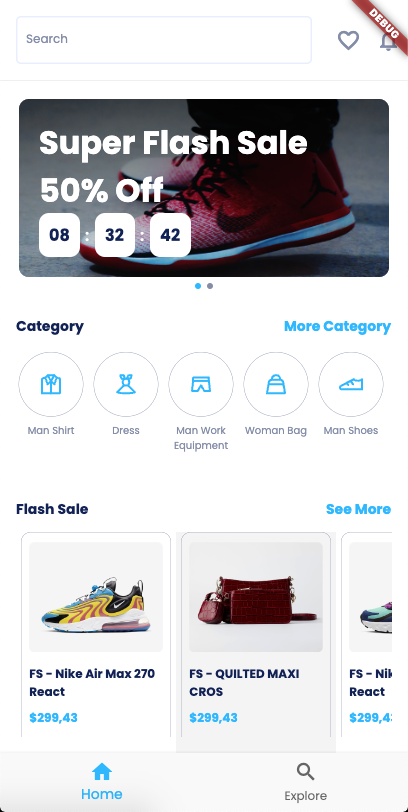
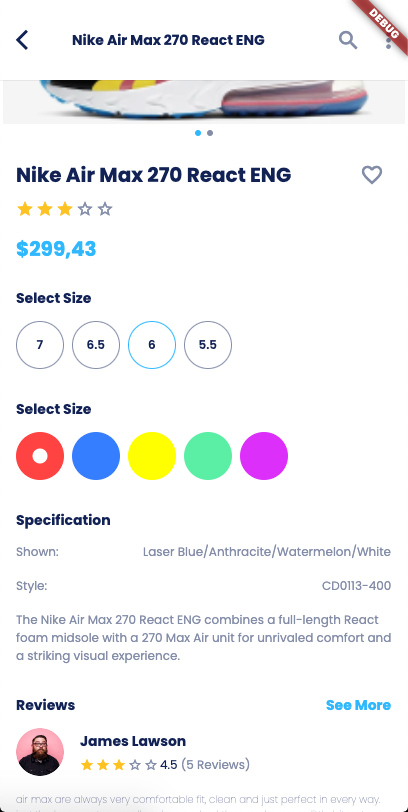
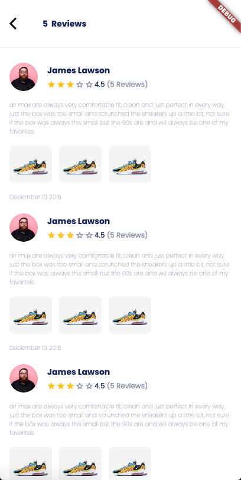
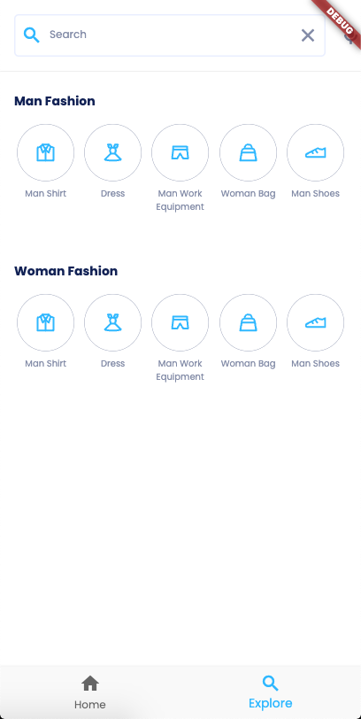

# guru_shop

GuruShop is a Flutter mobile application for E-commerce.

The project was built using the [Flutter Provider Architecture]().

Credit to [Derlaxy](https://derlaxy.gumroad.com/) for the design.

## Stacks

- Dart: 3.2.2
- FLutter: 3.13.8

## Plugins

- Provider
- Get_it
- Auto_route
- flutter_svg
- flutter_get_runner

## Preview

